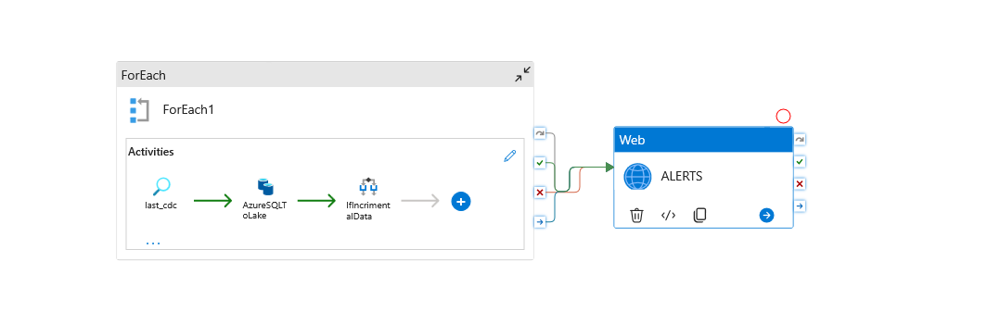

# azureproject
# Spotify End-to-End Data Pipeline on Azure

An end-to-end data engineering project that builds a complete data pipeline and warehouse for Spotify streaming data. Data flows from Azure SQL Database through Azure Data Factory into ADLS Gen2, gets transformed in Databricks using the medallion architecture and lands in a Unity Catalog-governed data warehouse with SCD Type 2 history tracking.

## Tech Stack

- **Azure SQL Database** — source system holding raw Spotify data (users, artists, tracks, streams, dates)
- **Azure Data Factory** — orchestrates incremental data ingestion from SQL to the data lake using CDC
- **Azure Data Lake Storage Gen2** — stores raw and processed data across bronze and silver containers
- **Azure Databricks** — runs transformations with PySpark and Delta Live Tables on serverless compute
- **Delta Lake** — provides ACID transactions, time travel, and schema evolution on the lake
- **Unity Catalog** — centralized governance, access control, and data lineage
- **Databricks Asset Bundles** — infrastructure-as-code for deploying pipelines
- **Jinja** — dynamic SQL generation for the gold layer joins

## Architecture

The project follows the **medallion architecture** with three layers:

**Bronze (raw)** — Data lands here exactly as it comes from Azure SQL, in Parquet format. No transformations, no cleaning. This is the single source of truth for raw data. Data Factory handles incremental ingestion using CDC (Change Data Capture), pulling only new or updated records from the source.



**Silver (cleaned)** — Auto Loader reads new files from bronze incrementally, applies transformations (deduplication, type casting, text normalization, column cleanup), and writes clean Delta tables. Each dimension and fact table has its own processing block with checkpoint-based incremental processing.

**Gold (business-ready)** — Delta Live Tables read from silver and apply SCD Type 2 (Slowly Changing Dimensions) to track historical changes. The gold layer is the final, query-ready warehouse.

## Data Model

The warehouse uses a star schema with five tables:

| Table | Type | Key | Description |
|-------|------|-----|-------------|
| FactStream | Fact | stream_id | Streaming events with user, track, timestamp, duration |
| DimUser | Dimension | user_id | User profiles with name and metadata |
| DimTrack | Dimension | track_id | Track details with name, genre, duration |
| DimArtist | Dimension | artist_id | Artist information with name, genre, country |
| DimDate | Dimension | date_key | Calendar dimension for time-based analysis |

## Key Implementation Details

### Incremental Ingestion (Data Factory)

The ingestion pipeline uses CDC to pull only changed records from Azure SQL. Each table has a timestamp column (`updated_at`) that Data Factory uses to determine what's new since the last run. The pipeline is parameterized — the same template handles all five tables through a ForEach loop.

### Bronze → Silver (Auto Loader)

Auto Loader (`cloudFiles`) monitors the bronze container and picks up new Parquet files automatically. Each table goes through:

- Schema evolution with `addNewColumns` to handle schema changes
- Deduplication on primary keys
- Text normalization (uppercase names, regex cleanup)
- Removal of `_rescued_data` column
- Checkpoint-based incremental processing

Example transformation for DimTrack:

```python
df_track = spark.readStream.format("cloudFiles")\
    .option("cloudFiles.format", "parquet")\
    .option("cloudFiles.schemaLocation", ".../DimTrack/schema")\
    .option("schemaEvolutionMode", "addNewColumns")\
    .load("abfss://bronze@.../DimTrack")

df_track = df_track.withColumn("duration_flag",
    when(col("duration_sec") < 150, "low")
    .when(col("duration_sec") < 300, "medium")
    .otherwise("high"))

df_track = df_track.withColumn("track_name", regexp_replace(col("track_name"), "-", " "))
```

### Silver → Gold (Delta Live Tables)

The gold layer uses DLT with `create_auto_cdc_flow` to implement SCD Type 2 on all dimension tables. This means historical changes are tracked automatically — when a user changes their name, both the old and new records are kept with validity timestamps.

```python
@dlt.table(name="dimuser_staging")
@dlt.expect_all_or_drop({"rule_1": "user_id IS NOT NULL"})
def DimUserStaging():
    return spark.read.table("spotify_data.silver.dimuser")

dlt.create_streaming_table("dimuser")

dlt.create_auto_cdc_flow(
    target="dimuser",
    source="dimuser_staging",
    keys=["user_id"],
    sequence_by="updated_at",
    stored_as_scd_type=2
)
```

### Dynamic SQL with Jinja

The project uses Jinja templates to generate join queries dynamically from a configuration list, making it easy to add new tables without rewriting SQL.

## Infrastructure Setup

The project runs on:

- **Azure Storage Account** (ADLS Gen2) with hierarchical namespace, hosting `bronze` and `silver` containers
- **Azure Databricks** workspace with Unity Catalog and serverless compute
- **Access Connector for Azure Databricks** with system-assigned managed identity and `Storage Blob Data Contributor` role on the storage account
- **Unity Catalog metastore** with storage credential and external locations for governed access to ADLS

## How to Reproduce

1. Create an Azure SQL Database and load the source tables
2. Create an ADLS Gen2 storage account with `bronze` and `silver` containers
3. Set up Azure Data Factory with the pipeline definitions from `pipeline/`
4. Create a Databricks workspace and configure Unity Catalog with a metastore
5. Create an Access Connector and assign storage roles
6. Run the Data Factory pipeline to ingest data into bronze
7. Run `src/silver/silver_dimensions.ipynb` to transform bronze → silver
8. Deploy the DLT pipeline with `databricks bundle deploy --target dev`
9. Run the gold pipeline from Jobs & Pipelines
